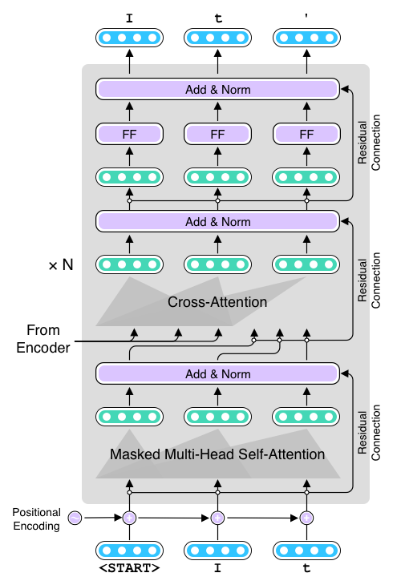

# xfspell — the Transformer Spell Checker



This is a Transformer-based English spell checker trained on 7M+ generated parallel sentences. 

## Usage

- Clone this repository
- Create a virtual environment (e.g., `python3 -m venv .pyenv`)
- Install requirements (e.g., `pip install -r requirements.txt`)
- Download [the pretrained model](https://xfspell.s3.amazonaws.com/models/model7m.tar.gz) and extract the content (`tar zxvf model7m.tar.gz`)
- Run: 
```
$ echo "tisimptant too spll chck ths dcment." \
    | python src/tokenize.py \
    | fairseq-interactive model7m/ \
    --path model7m/checkpoint_best.pt \
    --source-lang fr --target-lang en --beam 10 \
   | python src/format_fairseq_output.py
It's important to spell check this document.
``` 

## Fun examples

This spell checker clearly understands the long-range structures of the language:

```
$ echo "The book Tom and Jerry put on the yellow desk yesterday war about NLP."
    | python src/tokenize.py \
    | fairseq-interactive model7m/ \
    --path model7m/checkpoint_best.pt \
    --source-lang fr --target-lang en \
   | python src/format_fairseq_output.py
The book Tom and Jerry put on the yellow desk yesterday was about NLP.
```

```
$ echo "The books Tom and Jerry put on the yellow desk yesterday war about NLP." \
    | python src/tokenize.py \
    | fairseq-interactive model7m/ \
    --path model7m/checkpoint_best.pt \
    --source-lang fr --target-lang en \
   | python src/format_fairseq_output.py
The books Tom and Jerry put on the yellow desk yesterday were about NLP.
```

## How it's built

TO BE WRITTEN
